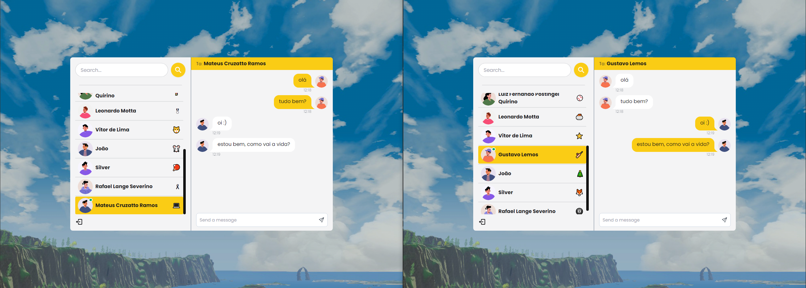

# Swellow App

Real-time chat app built with MERN stack (MongoDB, Express.js, React.js, Node.js) and Socket.io for two-way communication between the server and the client.

Deployment: [https://swellow-app.onrender.com](https://swellow-app.onrender.com)


## Features

- **User Registration and Login**: Users can register and log in to access the chat. Authentication is carried out using JWT tokens (JSON Web Tokens), providing an additional layer of security.

- **Real-Time Chat**: Users can exchange messages in real time with other connected users. Messages are delivered in real time without the need to refresh the page via Socket.io, providing a fluid and immersive experience.

- **New Message Notifications**: Users receive instant notifications when new messages are sent.

## Getting Started

### Prerequisites

- **Node.js and npm** installed globally on your machine.

- **MongoDB** installed and running on your local machine or using a database service hosted in the cloud.

### Installation and Configuration

1. Clone the repository;

   ```sh
   git clone https://github.com/mat-afk/swellow-app.git
   ```

2. Navigate to the project directory;

   ```sh
   cd swellow-app
   ```

3. Install server dependencies;

   ```sh
   npm install
   ```

4. Copy `.env.example` file to `.env` and change the environment variables to match your configuration;

   ```sh
   cp .env.example .env
   ```

5. Navigate to the client directory;

   ```sh
      cd ./frontend/
   ```

6. Install client dependencies;

   ```sh
   npm install
   ```

7. Start the server;

   ```sh
   cd ..
   npm run server
   ```

8. Start the client;

   ```sh
   cd ./frontend/
   npm run dev
   ```

9. The app will be accessible at [http://localhost:3000](http://localhost:3000).

## Database Schema

### User

```json
{
  "fullName": "string",
  "username": "string",
  "password": "string",
  "gender": "enum['male', 'female', 'non-binary']",
  "profilePicture": "string",
  "createdAt": "date",
  "updatedAt": "date"
}
```

### Message

```json
{
  "senderId": "string",
  "receiverId": "string",
  "message": "string",
  "createdAt": "date",
  "updatedAt": "date"
}
```

### Conversation

```json
{
  "participants": ["string"],
  "messages": ["string"],
  "createdAt": "date",
  "updatedAt": "date"
}
```

## HTTP Routes

### Auth

- **POST `/api/auth/register`**: Register a new user.
- **POST `/api/auth/login`**: Login an existing user.
- **POST `/api/auth/logout`**: Logout the current user.

### Messages

- **GET `/api/messages/:id`**: Get all messages from the conversation between the current user and another user.

- **POST `/api/messages/send/:id`**: Send a new message to another user.

### Users

- **GET `/api/users`**: Get all users.

## License

This project is licensed under the [MIT License](LICENSE).